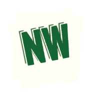

# NapkinWire



From sketch to prompt in seconds.

**[Try it here!](https://www.napkinwire.lat/)** | **[Demo Video](#demo)** | **[Examples](#examples)**

## What it does

Sketch UI layouts with simple rectangles and instantly get LLM-ready prompts. No accounts, no subscriptions, no BS.

**The problem:** Describing UI layouts to LLMs (or humans) in text is terrible. "Put a button on the right side, below the form, but not too close to the footer..." 🤮

**The solution:** Draw rectangles. Get perfect prompts. Build your UI.

## Why this exists

Built because I needed to mock up UIs quickly for AI coding workflows. Started sketching on actual napkins, realized this could be better.

I wanted the feeling of sketching ideas on the back of a napkin or whiteboard - dead simple, no friction between idea and communication.

**Real world usage:** I used NapkinWire to design NapkinWire's own homepage. It worked on the first try.

## Demo

*[Video/GIF placeholder - showing sketch → copy prompt → paste in LLM → generated code]*

## How it works

1. **Draw rectangles** on a canvas (mobile-friendly)
2. **Purple rectangles** become text content areas  
3. **Label** what goes in each area ("User avatar", "Article title", etc.)
4. **Copy prompt** that actually works with ChatGPT, Claude, Cursor, etc.
5. **Generate code** in your LLM of choice

## Examples

### Input: Simple login form sketch
```
[Rough ASCII representation of your layout]

Content areas:
1: Company logo
2: Email input field  
3: Password input field
4: Login button
```

### Output: Perfect LLM prompt
```
Create a login form using React with the following layout:

[Generated ASCII layout]

Content areas:
1: Company logo - centered header branding
2: Email input field - user email entry
3: Password input field - secure password entry  
4: Login button - primary action button

Additional requirements: Clean, modern styling with proper form validation.
```

## Features

- ✅ Works on mobile (PWA installable)
- ✅ Touch drawing with snap-to-grid
- ✅ Multiple layouts (desktop, mobile, square)
- ✅ Supports both GUI and TUI frameworks
- ✅ One-click copy to clipboard
- ✅ Completely free and open source
- ✅ No data leaves your device

## Anti-features (by design)

- ❌ No user accounts or login
- ❌ No data collection or tracking
- ❌ No subscription fees  
- ❌ No complex design tools or learning curve
- ❌ No cloud dependencies

## Usage

Just start drawing. Everything updates automatically as you sketch.

**Pro tip:** Use purple rectangles for any area that needs custom content (text, images, forms, etc.).

## Roadmap

- [ ] **MCP Server** - Claude Desktop integration for seamless sketch → code workflow
- [ ] **Diagram mode** - Flowcharts and process diagrams with connection detection
- [ ] **Template library** - Common UI patterns for faster sketching
- [ ] **Export options** - PNG, SVG, and more format support

*Want something specific? [Open an issue](https://github.com/AJ-Gonzalez/NapkinWire/issues)*

## Installation & Development

```bash
# Clone and run locally
git clone https://github.com/AJ-Gonzalez/NapkinWire.git
cd NapkinWire/web
python -m http.server 8000  # or your preferred local server

# No build step needed - vanilla JS keeps it simple
```

## Who this is for

- **Developers** who need quick UI mockups for AI coding workflows
- **Product managers** explaining processes and user flows to LLMs
- **Business analysts** documenting workflows and system diagrams  
- **Designers** who want to communicate ideas without Figma overhead  
- **Anyone** who thinks better with visual layouts than pure text

## License

Licensed under Apache 2.0 - commercially friendly, use however you want.

## Contributing

PRs welcome. Philosophy: keep it simple, keep it fast, keep it free.

---

*Built with ❤️ for the "sketch on a napkin" feeling we all miss.*